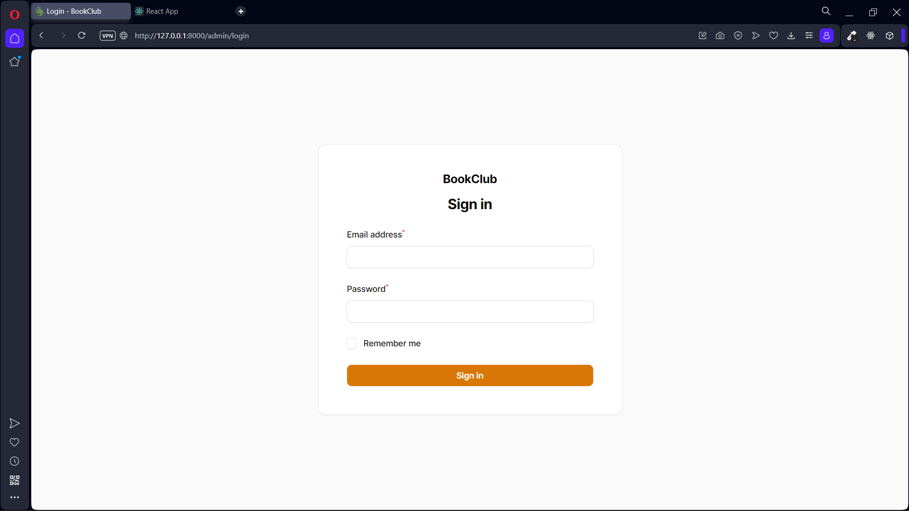

Api for bookclub project

Made using Laravel, Sanctum and Filament. 

This was built over the period of a week during our practical training session at [Wintech](https://wintech.com.kh/). 

# Setup
Make sure your php version is at least 8.0^

Create an .env file and specify database name
> you don't have to create, just specify the name

```shell
composer install
php artisan storage:link
php artisan key:generate
php artisan migrate
```
> type yes if artisan asks if you want to create database

Filamentphp dashboard Setup
```shell
php artisan icons:cache
php artisan make:filament-user
```

# Screenshots
## Admin panel (Filament)
Login

Book list

Book edit


## React frontend
Home

Book detail

Login 
